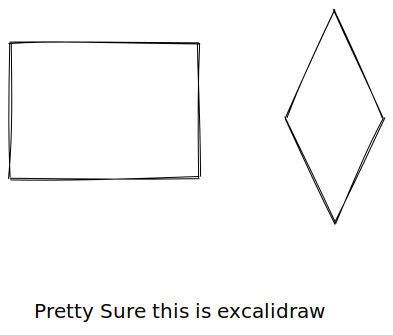

# How to do everything

[https://longforwisdom.gitbook.io/test/](https://longforwisdom.gitbook.io/test/) <- Live Version

\---



This is a hint





Exclamation Hint



Triangle Exclamation Hint



Tick Hint



> This is a quote

```
// Some code
```


caption here




Tabs



I guess



Content 3



<details>

<summary>Visible Content</summary>

Expandable Content

</details>

$$
f(x) = x * e^{2 pi i \xi x}
$$




Google Sheet Embed


> Page last reviewed: -\
> Next review due: -
